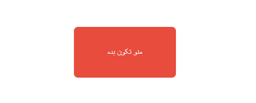
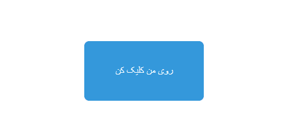
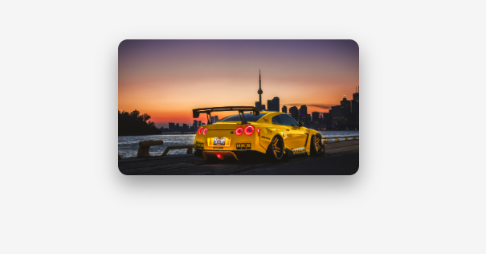

# 🎨 jQuery UI Effects Showcase

A simple **3-part project** demonstrating basic jQuery and jQuery UI effects.  
This project is perfect for beginners to learn **interactivity, animations, and styling with jQuery**.

---
## 🚀 Demo

### 1️⃣ Shake Effect
Click the button to see it **shake**:


### 2️⃣ Hide Effect
Click the button to **hide** it:


### 3️⃣ Box Shadow Effect
Image gets a **box-shadow** on page load:



## 🛠️ Features

### 1️⃣ Shake Effect
- A button that **shakes** when clicked.
- Uses **jQuery UI** for the shake animation.
- Options like distance, times, and duration are configurable.

### 2️⃣ Hide Effect
- A button that **disappears** when clicked.
- Demonstrates basic **DOM manipulation with jQuery**.

### 3️⃣ Box Shadow Effect
- Adds a **box-shadow** to an image on page load.
- Shows how to **dynamically style elements** using jQuery.

---

## 📂 Project Structure
├── shake
│ └── index.html # Shake button demo
├── hide
│ └── index.html # Hide button demo
└── boxShadow
└── index.html # Image box-shadow demo

---

## 📌 How to Use
1. Clone the repository:  
```bash
git clone https://github.com/YourUsername/jquery-effects-showcase.git

Open the desired demo in your browser (e.g., shake/index.html).

Interact with the buttons or images to see the effects in action.

🎯 Purpose

This project was created as a practice for jQuery to:

Learn basic DOM manipulation.

Implement UI effects with jQuery and jQuery UI.

Understand event handling in JavaScript.

🛠️ Technologies Used

HTML5

CSS3

JavaScript

jQuery

jQuery UI

📌 Notes

Make sure your browser supports jQuery and jQuery UI.

Images must be placed correctly in the folder (boxShadow demo) to display properly.


